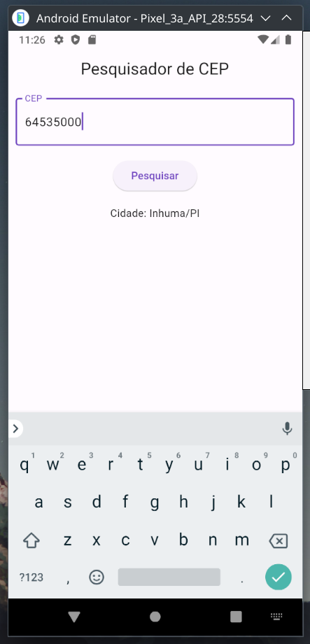

# Pesquisador de CEPs Brasileiros



Este é um aplicativo Flutter simples que permite aos usuários pesquisar CEPs brasileiros utilizando a API BrasilAPI. O aplicativo utiliza o padrão de gerenciamento de estado BLoC para lidar com a lógica de negócios e a exibição de resultados.

## Funcionalidades

- Pesquisa de CEPs brasileiros.
- Exibição de informações detalhadas sobre o CEP pesquisado, incluindo cidade, estado e bairro.

## Configuração

### Pré-requisitos

- Flutter instalado. Para obter instruções de instalação, consulte [o guia oficial do Flutter](https://flutter.dev/docs/get-started/install).

### Configuração do Projeto

1. Clone este repositório para sua máquina local:

   ```bash
   git clone https://github.com/seu-usuario/pesquisador-de-ceps.git
   cd pesquisador-de-ceps

2. Execute o aplicativo:

   ```bash
    flutter run

O aplicativo deve ser compilado e executado em um emulador ou dispositivo Android.

## Como Usar

1. Abra o aplicativo Pesquisador de CEPs no seu dispositivo Android.
2. Insira um CEP válido na caixa de pesquisa.
3. Toque no botão "Pesquisar".
4. Os detalhes do CEP, incluindo cidade, estado e bairro, serão exibidos na tela.

## BLoC

O aplicativo utiliza o padrão BLoC para gerenciar o estado da aplicação. O BLoC é responsável por lidar com as operações de busca de CEPs e atualizar a interface do usuário de acordo com os resultados. As transições de estado são tratadas na classe SearchCepBloc.
API BrasilAPI

Este aplicativo utiliza a API BrasilAPI (https://brasilapi.com.br) para buscar informações de CEPs brasileiros. A classe SearchCepService é responsável por fazer chamadas à API e processar os resultados.

## Contribuições

Contribuições são bem-vindas! Sinta-se à vontade para abrir um problema ou enviar um pull request para melhorias ou correções.
